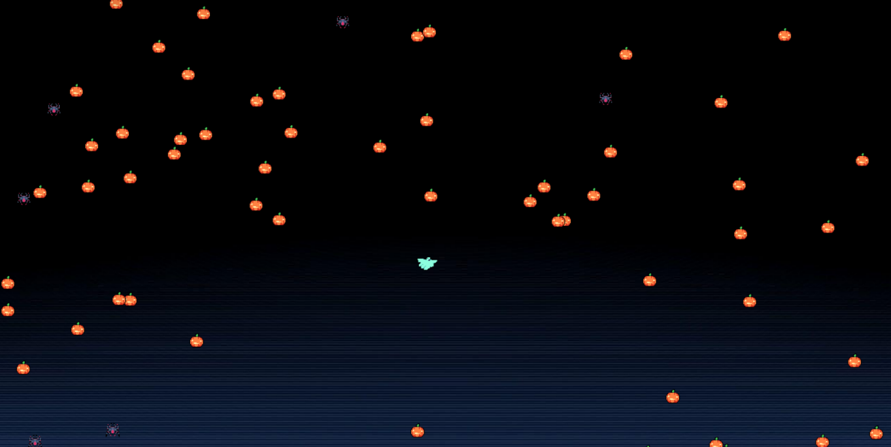

# Point 
## INTRODUCTION

- Name: Pham Duc Hoang
- ID: 22021200
- Game: __Point__ / Lap Trinh Nang Cao / UET (QH-2022)

## How to play 
- Use left mouse click to select the nearest point. You can then hold and release to get the right force
- The more pumpkins you eat, the more points you get
- Game over when you touch a spider
- You can play again and again to improve your score

## Modify
- You can change music and sound effects in __main.cpp__ and change background, assets in __RenderWindow.cpp__

